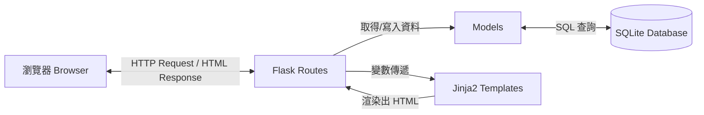

# 系統架構設計 (Architecture) - 天氣預報系統

## 1. 技術架構說明

本專案採用 Python 的 Flask 框架作為後端核心，搭配 Jinja2 模板引擎進行前端頁面渲染，並使用 SQLite 作為資料庫儲存地區與天氣預報假資料。這是一個標準的 Server-Side Rendering (SSR) 單體式應用架構。

### 選用技術與原因
- **後端 (Python + Flask)**：Flask 輕量且彈性高，適合快速開發中小型專案，且內建對 Jinja2 的良好支援。
- **模板引擎 (Jinja2)**：能將後端變數直接嵌入 HTML 中，不需要額外維護一套前端框架（如 React/Vue），降低開發複雜度。
- **資料庫 (SQLite)**：以單一檔案 (`database.db`) 形式儲存，不需額外安裝或維護資料庫伺服器，非常適合本專案的測試與展示需求。
- **前端樣式 (Bootstrap 5)**：快速套用響應式網頁設計 (RWD)，確保在手機與電腦上都有良好的閱讀體驗。

### Flask MVC 模式說明
雖然 Flask 本身不強制規定架構，但本專案將採用類似 MVC（Model-View-Controller）的模式來組織程式碼：
- **Model (資料模型)**：負責與 SQLite 資料庫溝通，處理資料的 CRUD（新增、讀取、更新、刪除）操作。對應 `app/models/` 資料夾。
- **View (視圖)**：負責呈現使用者介面 (UI)，接收 Controller 傳遞的資料並渲染為 HTML。對應 `app/templates/` 資料夾。
- **Controller (控制器)**：負責接收使用者的 HTTP 請求 (Request)，呼叫對應的 Model 取得資料，再將資料傳遞給 View 渲染。對應 `app/routes/` 資料夾。

## 2. 專案資料夾結構

```text
web_app_development/
├── app/
│   ├── __init__.py      # 初始化 Flask app
│   ├── models/          # Model: 資料庫模型與操作
│   │   ├── region.py    # 地區資料模型
│   │   └── weather.py   # 天氣預報資料模型
│   ├── routes/          # Controller: 路由邏輯
│   │   └── main.py      # 主要路由設定
│   ├── static/          # 靜態資源 (CSS, JS, 圖片)
│   │   └── style.css    # 自訂樣式表
│   └── templates/       # View: Jinja2 模板
│       ├── base.html    # 基礎模板 (共用 Header/Footer)
│       └── index.html   # 首頁 (天氣查詢面板)
├── database/            # 資料庫相關腳本
│   └── schema.sql       # 資料表建立與測試資料 SQL
├── docs/                # 專案文件 (PRD, 架構, 流程圖等)
├── instance/            # 實例資料夾 (不進版控)
│   └── database.db      # SQLite 資料庫檔案
├── .env.example         # 環境變數範例檔
├── requirements.txt     # Python 依賴套件清單
└── app.py               # 專案執行入口
```

## 3. 元件關係圖

以下展示使用者如何透過瀏覽器與系統互動的資料流：



## 4. 關鍵設計決策

1. **將天氣資料寫入本地資料庫 (Mock Data)**
   - **原因**：為了確保系統可以獨立、穩定運作，不受外部天氣 API 穩定性與呼叫次數限制。我們將天氣與地區資料預先建置在 SQLite，供開發與展示使用。
2. **採用 Server-Side Rendering (不使用 SPA)**
   - **原因**：考量到此系統規模較小，且著重於內容展示，使用 Jinja2 進行伺服器端渲染能有更快的首屏載入速度，也較利於基本的 SEO。
3. **功能模組化 (Blueprint 概念)**
   - **原因**：即使系統不大，我們依然將 `models` 與 `routes` 分離，這能確保程式碼好讀、好維護，若未來需要擴充也能快速加入。
