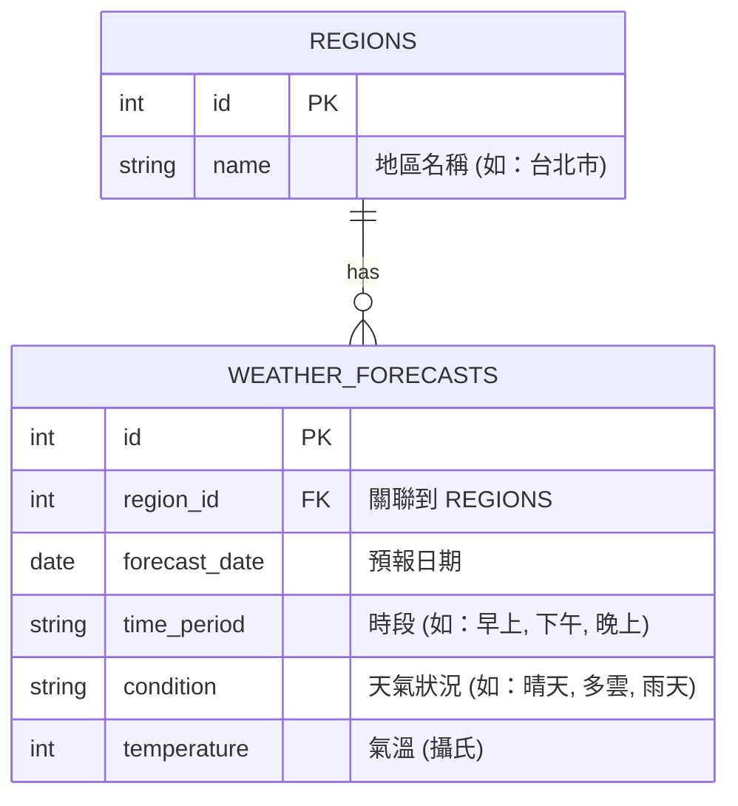

# 資料庫設計 (DB Design) - 天氣預報系統

## 1. ER 圖（實體關係圖）

本系統使用 SQLite 儲存地區名稱以及預先建置好的天氣預報假資料（Mock Data）。

## 2. 資料表詳細說明

### 2.1 REGIONS (地區資料表)
儲存可供使用者查詢的縣市或區域清單。

| 欄位名稱 | 型別 | 必填 | 說明 |
| --- | --- | --- | --- |
| `id` | INTEGER | 是 | Primary Key, 自動遞增 |
| `name` | TEXT | 是 | 縣市名稱（例如：台北市、台中市、高雄市） |

### 2.2 WEATHER_FORECASTS (天氣預報資料表)
儲存不同地區在不同日期、時段的天氣狀況。

| 欄位名稱 | 型別 | 必填 | 說明 |
| --- | --- | --- | --- |
| `id` | INTEGER | 是 | Primary Key, 自動遞增 |
| `region_id` | INTEGER | 是 | Foreign Key, 對應 `REGIONS.id` |
| `forecast_date` | TEXT | 是 | 日期 (格式: YYYY-MM-DD) |
| `time_period` | TEXT | 是 | 時段 (例如: 早上、下午、晚上) |
| `condition` | TEXT | 是 | 天氣狀況描述 (例如: 晴朗、多雲、下雨) |
| `temperature` | INTEGER | 是 | 氣溫 (攝氏) |

## 3. SQL 建表語法

請參考檔案：`database/schema.sql`

## 4. Python Model 程式碼規劃

- **使用套件**：內建的 `sqlite3`
- **資料庫路徑**：`instance/database.db`
- **Model 檔案路徑**：
  - `app/models/region.py`：實作 `get_all_regions()` 等方法。
  - `app/models/weather.py`：實作 `get_forecasts(region_id, date, time_period)` 等方法。
