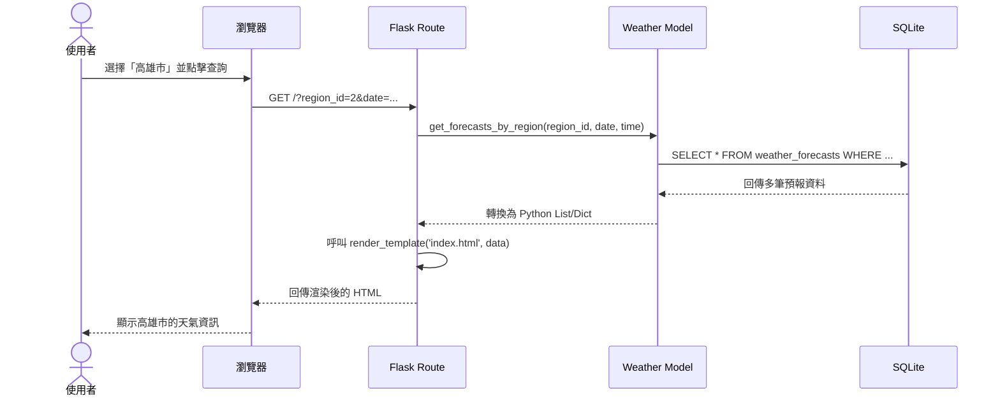

# 流程圖設計 (Flowchart) - 天氣預報系統

## 1. 使用者流程圖（User Flow）

此流程圖描述一般民眾進入天氣預報系統後，如何進行地區、日期與時間的篩選與查詢。

```mermaid
flowchart LR
    Start([使用者開啟網頁]) --> Home[首頁 - 天氣查詢面板]
    
    Home --> Action{使用者操作}
    
    Action -->|查看預設地區天氣| ViewCurrent[檢視當前天氣與預報]
    Action -->|選擇特定地區| SelectRegion[下拉選單選擇縣市]
    Action -->|選擇特定日期/時間| SelectDateTime[選擇日期與時間段]
    Action -->|點擊政府氣象局連結| GoGov[另開分頁前往政府氣象網站]

    SelectRegion --> FilterAction[提交查詢 (GET Request)]
    SelectDateTime --> FilterAction
    
    FilterAction --> Reload[重新載入首頁]
    Reload --> ViewCurrent
```

## 2. 系統序列圖（Sequence Diagram）

此序列圖描述使用者在畫面上選擇不同地區並送出查詢時，系統內部各元件如何互動並回傳結果。



## 3. 功能清單對照表

以下表格定義了主要操作對應的 URL 路徑與 HTTP 方法：

| 功能 | HTTP 方法 | URL 路徑 | 說明 |
| --- | --- | --- | --- |
| 查看天氣與查詢面板 | GET | `/` | 首頁。可透過 URL 查詢字串 (query parameters) 傳遞 `region_id`、`date`、`time_period` 進行篩選。 |
| 連往政府網站 | GET | 外部連結 | 直接提供帶有 `target="_blank"` 的連結，導向中央氣象局。 |
